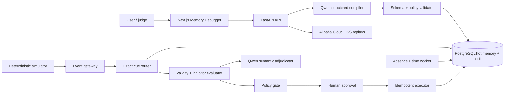

# Latch / MementoVM

> Most agents remember what happened. **Latch remembers what must happen**, notices when the right future condition arrives, and acts exactly once under user control.

Latch is an open-source, Qwen-powered prospective-memory runtime for long-running agents. It compiles ordinary future commitments into typed, versioned **Intention Programs**, monitors only the relevant cues, exposes every decision in a Memory Debugger, and removes completed obligations from active context.

**Global AI Hackathon with Qwen Cloud · Track 1 — MemoryAgent**

## The gap

Vector memory is good at answering “what did the user say before?” It is not a safe control plane for “what must I notice later, what would invalidate that plan, and when may I act?” Latch makes those future conditions explicit:

- Event, time, state, compound, inhibitor, and absence triggers.
- Immutable revisions, cancellation, rescheduling, and supersession.
- Deterministic predicates before bounded semantic adjudication.
- Focus-time and approval preferences stored separately from task memory.
- Human approval for external writes, bound to an action hash.
- Database-backed idempotency and an atomic action claim.
- Purpose-based forgetting after completion or invalidation.
- Replayable evidence for action and non-action.

## Three-minute proof

The seeded **Contract Approval — Official Demo** walks through ten steps:

1. Capture a legal-approval commitment, inhibitor, absence rule, and focus preference.
2. Revise it in a new session to also require finance approval.
3. Reject a marketing “approval” lure.
4. Reject an old legal response for document v6.
5. Prime the memory on exact legal approval for contract-043 / v7.
6. Reject finance approval for deal-999.
7. Defer the due notification during the 09:00–11:00 focus block.
8. Request approval after focus time and create one simulated draft.
9. Deduplicate the replayed webhook and approval click.
10. Detect a missing legal response after 48 hours and draft a Mark escalation.

The same normalized event contract drives both the simulator and production gateway.

## Judge materials

- Pitch deck: [PowerPoint](docs/pitch/Latch-MementoVM-Pitch-Deck.pptx) and [PDF](docs/pitch/Latch-MementoVM-Pitch-Deck.pdf).
- Demo video: [2:37 submission cut](docs/demo/Latch-MementoVM-Demo.mp4).
- Demo narration: [three-minute script](docs/demo/SCRIPT.md).
- Demo capture plan: [shot list](docs/demo/SHOT_LIST.md).
- Measured results: [evaluation report](docs/evaluation/REPORT.md).
- Submission copy: [Devpost draft](docs/submission/DEVPOST_DRAFT.md).

## Architecture



Production runs as five containers on **Alibaba Cloud ECS**: Caddy, Next.js, FastAPI, a PostgreSQL-backed worker, and PostgreSQL 16/pgvector. Replay bundles are uploaded with the official Alibaba Cloud OSS SDK. See [the cloud proof](deployment/ALIBABA_CLOUD_PROOF.md) and [OSS integration](backend/app/integrations/alibaba_oss.py).

## Qwen Cloud

All model traffic crosses one adapter: [`QwenGateway`](backend/app/llm/qwen_gateway.py).

| Task | Default model | Safety boundary |
|---|---|---|
| Intention compilation | `qwen3.7-plus` | Structured JSON, thinking disabled, local schema validation |
| Compiler repair | `qwen3.7-plus` | One repair attempt, then quarantine/fallback |
| Semantic cue adjudication | `qwen3.6-flash` | One predicate and bounded evidence only |
| Human-readable explanation | `qwen3.6-flash` | Never controls runtime state |

Exact identifiers, time rules, inhibitors, lifecycle state, approval requirements, and action claiming are deterministic. If Qwen credentials or quota are unavailable, the published scenario remains runnable with the clearly labeled deterministic compiler; the System screen shows which mode is active.

## Measured evaluation

`PM-Mini v1` contains 60 deterministic scenarios spanning exact cues, entity lures, stale cues, inhibitors, absence cues, and cancellations. Results are computed by [`evaluation.py`](backend/app/services/evaluation.py), stored per run, and shown in the app—no performance number is hard-coded into the UI.

Current local run:

| System | PM F1 | False alarms | Misses |
|---|---:|---:|---:|
| No memory | 0.000 | 0 | 25 |
| Vector memory | 0.500 | 35 | 5 |
| Todo ledger | 0.615 | 20 | 5 |
| **MementoVM** | **1.000** | **0** | **0** |

These results characterize this published synthetic dataset, not general production performance. Run `make benchmark` to reproduce them and inspect failures through the Evaluation screen.

## Local quickstart

Requirements: Docker with Compose v2.

```bash
cp .env.example .env
docker compose up --build
```

Open `http://localhost:3000`. API documentation is at `http://localhost:8000/docs`.

For a host-native development loop:

```bash
python -m venv .venv
# Activate the environment, then:
pip install -e ".[dev]"
npm --prefix frontend install
uvicorn backend.app.main:app --reload --port 8000
npm --prefix frontend run dev
```

The host-native API defaults to SQLite for convenience. Docker Compose and Alibaba Cloud use PostgreSQL 16, which is the release persistence path.

## Configuration

Copy `.env.example`; never commit `.env`. The release-critical values are:

- `DASHSCOPE_API_KEY` — Qwen Cloud API key.
- `DATABASE_URL` and `POSTGRES_PASSWORD` — durable store.
- `APP_SECRET_KEY` and `EVENT_INGEST_API_KEY` — application and event gateway secrets.
- `ALIBABA_CLOUD_OSS_REGION`, `ALIBABA_CLOUD_OSS_ENDPOINT`, and bucket credentials or an ECS RAM role.
- `PUBLIC_DOMAIN` and `PUBLIC_BASE_URL` — TLS host and public URL.

The ECS deploy script refuses to release unless `APP_ENV=production` and the
database, application, event-ingestion, and Qwen secrets are non-placeholder
values. In production, every event—including one labeled as simulator data—
must present `X-Event-API-Key`; malformed deployments fail closed.

The full catalog, with safe empty defaults, is in [`.env.example`](.env.example).

## API map

- `GET /healthz`, `GET /readyz`
- `POST /v1/messages`
- `GET /v1/intentions`, `GET /v1/intentions/{id}`
- `POST /v1/intentions/{id}/revise|cancel|confirm`
- `POST /v1/events`
- `GET /v1/approvals/pending`, `POST /v1/approvals/{id}/decision`
- `POST /v1/simulator/reset`, step, and clock endpoints
- `POST /v1/evaluations`, `GET /v1/evaluations/latest`
- `POST /v1/replays/{id}/export`
- `GET /v1/system/cloud-proof`

## Verification

```bash
make lint
make test
make build
make smoke BASE_URL=http://localhost:8000
make reliability BASE_URL=http://localhost:8000
```

The automated suite covers schema validity, cross-session revision, lure rejection, compound cues, focus deferral, action-hash approval, duplicate events, duplicate approvals, exactly-once draft creation, absence detection, hot-index removal, prompt-injection containment, and all four evaluation modes.

## Alibaba Cloud deployment

The supported judging profile is a single Ubuntu ECS instance plus a private OSS bucket:

This demo has a hard zero-out-of-pocket deployment policy. Provision only from
an active free-tier offer, keep paid add-ons and auto-renewal disabled, and stop
if the final confirmation does not show trial coverage and a USD 0 immediate
charge. The exact approved configuration, quota checks, and teardown rules are
in [`TRIAL_CREDITS_RUNBOOK.md`](deployment/TRIAL_CREDITS_RUNBOOK.md).

1. Open ports 80/443 publicly and SSH only from the operator IP.
2. Install Docker Engine and Compose v2 using [`install_docker_ecs.sh`](deployment/install_docker_ecs.sh).
3. Clone the tagged repository to `/opt/mementovm` as the non-root `deploy` user.
4. Create `.env` on the server and use an instance RAM role or least-privilege OSS credentials.
5. Run [`deploy_ecs.sh`](deployment/deploy_ecs.sh).
6. Execute the smoke test, export one replay to OSS, restart the containers, and confirm the intention survives.

Caddy terminates HTTPS automatically when `PUBLIC_DOMAIN` resolves to the ECS public IP. Full evidence and the post-deploy checklist live in [deployment/ALIBABA_CLOUD_PROOF.md](deployment/ALIBABA_CLOUD_PROOF.md).

## Security and limitations

- External, financial, and destructive actions cannot bypass approval.
- Event text is labeled untrusted and never treated as an instruction.
- Tool IDs are allowlisted and outputs are audit-recorded.
- Secrets are environment-only; public system output is redacted.
- The hackathon connector is a simulated email-draft adapter, not Gmail or Outlook.
- The benchmark is intentionally synthetic and domain-focused.
- Demo reset is disabled when `DEMO_MODE=false`.

Report vulnerabilities privately as described in [SECURITY.md](SECURITY.md).

## Repository map

```text
frontend/      Next.js Memory Debugger
backend/       FastAPI, domain runtime, Qwen and OSS adapters
worker/        PostgreSQL-backed monitoring worker
simulator/     Published demo scenario
evaluation/    Dataset documentation and benchmark report
deployment/    ECS scripts, Compose profile, Caddy, proof checklist
docs/          Architecture, demo script, and submission material
tests/         Unit and end-to-end API workflow coverage
```

## Roadmap

After the hackathon: connector SDKs, RDS/ACK deployment, team memory governance, richer absence/recurrence semantics, outcome feedback, and an open ecosystem of safe tool adapters.

## License

Apache License 2.0. See [LICENSE](LICENSE) and [NOTICE.md](NOTICE.md).
